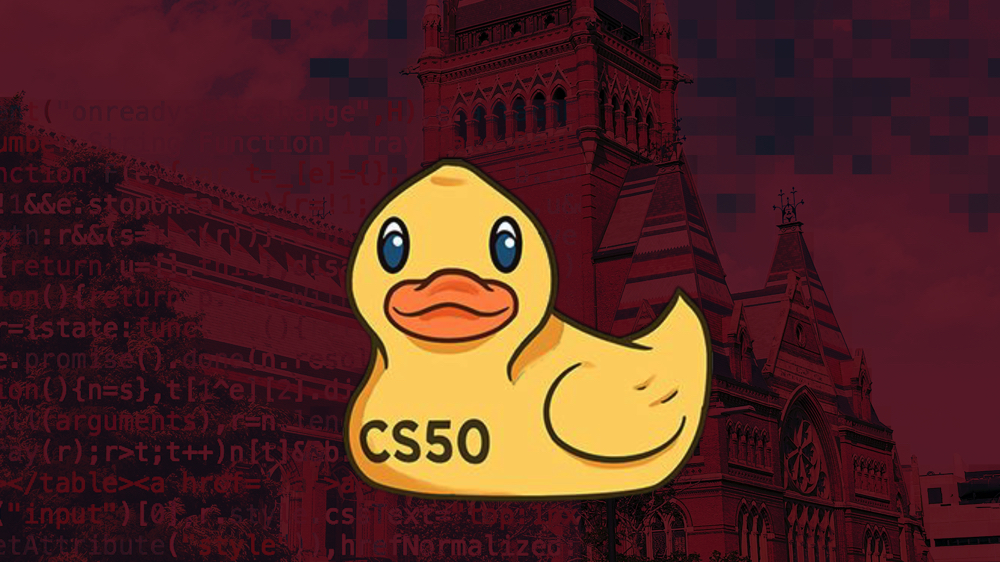

# Hannes Hedberg's Portfolio :computer:

Welcome to my GitHub portfolio! I'm Hannes Hedberg, a student specializing in AI and Machine Learning at IT-Högskolan. This repository showcases my journey, encompassing various projects and experiences. Explore the sections below to learn more about my work.

## Projects :speaker:

- IT-Högskolan
- Internship at Bilvision
- Harvard, CS50
- Personal projects, Tools and Arma 3 Modding
- Modding in Empire at War Expanded (EAWX)

##### Contact Me :email:
[Hannes LinkedIn Profile](https://www.linkedin.com/in/hannes-hedberg-63854719b/)

---

## IT-Högskolan :notebook:

I'm currently a student at IT-Högskolan, focusing on AI and Machine Learning. Here's an overview of my coursework:

#### Full Course Descriptions:

  
<b>Click to Expand</b>

  **1. [Intro to AI][course1]**
  - *TLDR:* AI, Machine Learning, Report
  - *Description:* Introduction to AI with a machine learning report.

  **2. [Python Programming][course2]**
  - *TLDR:* Python, Foundation
  - *Description:* First Python course, establishing a solid foundation.

  **3. [Data Processing][course3]**
  - *TLDR:* Data Mining, Data Cleaning, Pandas, Security
  - *Description:* Foundational course that covers techniques for data exploration and handling, focusing on data mining, data combination, aggregation, missing data management, dimension reduction, and data cleaning using the Python Pandas library, with an emphasis on GDPR compliance and data security.

  **4. [Linear Algebra][course4]**
  - *TLDR:* Vectors, Matrices, Linearity
  - *Description:* Foundational course that explores fundamental concepts such as vectors, scalar products, vector products, equations of lines and planes, matrix operations, and linearity, serving as a crucial mathematical basis for understanding many machine learning algorithms.

  **5. [Statistical Methods][course5]**
  - *TLDR:* Probability, Hypothesis Testing, NumPy
  - *Description:* This course covers probability theory, fundamental statistical concepts, and their application in machine learning. The course includes discussions on common distributions, correlation, covariance, expected value, estimation, and hypothesis testing, along with practical exercises using Python and NumPy.

  **6. [Machine Learning][course6]**
  - *TLDR:* AI, Predictive Modeling, Scikit-learn, Visualization
  - *Description:* Introduction to machine learning and AI, covering key concepts. Discussions on predictive modeling, data clustering, self-learning decision trees, and the foundation for artificial neural networks. Provided a foundational understanding of machine learning models and techniques for data handling, training, and evaluation. Technologies and tools used in the course include Visual Studio Code, Git/GitHub, Python, NumPy, Pandas, and various visualization tools like Matplotlib, Seaborn, and Plotly.

  **7. [Databaser][course7]**
  - *TLDR:* Database Administration, SQL, SQL Query Language
  - *Description:* This course focuses on database communication and administration, with an emphasis on SQL query language. It covers fundamental concepts of relations databases, information structuring, transactions, storage and access methods. Additionally, the course briefly introduces other database types such as NoSQL and tools like Elasticsearch. In the course we create and execute efficient SQL queries for data analysis, as well as configuring and applying database connections using both database management tools and Python. It provides knowledge and competence in databases and SQL to connect, retrieve, and analyze data stored in relational databases.

  **8. [Data Engineering][course8]**
  - *TLDR:* Real-world, Web Scraping, Agile, Cloud, React
  - *Description:* This course focuses on data engineering with a strong emphasis on practical applications in real-world machine learning scenarios. Collaborative group projects simulate real-life situations involving stakeholders and CEOs. Students learn how to deploy AI models using OpenAI's API. We conduct web scraping of various AI-related articles from the internet, format, summarize, and translate the content into multiple languages. This data is then integrated into a Discord platform, where users can interact with a bot we've developed to receive live articles. All data is stored in a database, and we utilize queries to extract necessary information in the cloud, employing platforms like AWS, Azure, or Google Cloud. The course introduces agile project management methodologies such as Scrum and Kanban. Additionally, students gain practical experience in technologies like React for web development, enhancing their skills in creating and deploying AI solutions.

  **9. [LIA1 (Internship1)][course9]**
  - *TLDR:* Internship, NLP, Car Brands, 32 Million Entries
  - *Description:* I completed an 8-week internship at Bilvision as a Data Scientist, where I focused on developing a Natural Language Processing (NLP) model with an emphasis on Named Entity Recognition (NER). The goal was to detect car brands and models within a database containing over 32 million entries. For more details, please refer to [#Bilvision - Internship 1].

  **10. [Deep Machine Learning][course10]**
  - *TLDR:* Deep Learning, Advanced ML
  - *Description:* [Description to be added]

  **11. [LIA2 (Internship2)][course11]**
  - *TLDR:* Internship, Project
  - *Description:* [Description to be added]

#### TL;DR (Too Long, Didn't Read)

| Course                                   | Short Description                                             |
| ---------------------------------------- | ------------------------------------------------------- |
| 1. [Intro to AI][course1]                   | AI, Machine Learning, Report |
| 2. [Python Programming][course2]            | Python, Foundation |
| 3. [Data Processing][course3]               | Data Mining, Data Cleaning, Pandas, Security |
| 4. Linear Algebra             | Vectors, Matrices, Linearity |
| 5. [Statistical Methods][course5]            | Probability, Hypothesis Testing, NumPy |
| 6. [Machine Learning][course6]              | AI, Predictive Modeling, Scikit-learn, Visualization |
| 7. [Databaser][course7]                     | Database Administration, SQL |
| 8. [Data Engineering][course8]              | Real-world, Web Scraping, Agile, Cloud, React, Discord Bot, OpenAI, ChatGBT, AI Prompting |
| 9. Internship 1 (LIA 1)            | Bilvision, Internship, Automation, Data bases, NLP, NER, Car Brands, Machinelearning, Model training, 32 Million vehicles |
| 10. [Deep Machine Learning][course10]       | Deep Learning, Advanced ML |
| 11. Internship 2 (LIA 2)          | Internship, Project |

[course1]: https://github.com/Hannesssss/Intro-till-AI-Hannes-Hedberg 
[course2]: https://github.com/Hannesssss/Python-Programming-Hannes-Hedberg
[course3]: https://github.com/Hannesssss/Databehandling-Hannes-Hedberg
[course4]: https://github.com/Hannesssss
[course5]: https://github.com/Hannesssss
[course6]: https://github.com/Hannesssss
[course7]: https://github.com/Hannesssss
[course8]: https://github.com/Hannesssss
[course9]: https://github.com/Hannesssss
[course10]: https://github.com/Hannesssss
[course11]: https://github.com/Hannesssss

[IT-Högskolans Webbsite](https://www.iths.se/utbildningar/utvecklare-inom-ai-och-maskininlarning/)

-----

## Bilvision - First Internship &#128663;

### Internship Full Description 

  
<b>Click to Expand</b>

  
During my 8-week tenure at Bilvision, I worked as a Data Scientist. Bilvision utilizes Microsoft Database Manager for its organizational needs. They encountered numerous time-consuming and repetitive tasks within their workflow, prompting the need for machine learning solutions to automate and expedite processes. Their database contained an extensive collection of approximately 32 million vehicles. While a substantial portion of the data included accurate labels for brands and models, a significant amount of information remained concealed within unstructured text strings.

To address this challenge, I developed and trained a model using Natural Language Processing (NLP), specifically focusing on Named Entity Recognition (NER). I created two distinct models; one was designed to identify car brands mentioned in text, and the other was responsible for locating references to car models. The results of these models were stored in separate columns for further processing. Additionally, I implemented an Auto-spelling program, which incorporated the Levenshtein distance algorithm to determine the closest possible matches for misspelled words. This spelling verification process was further enhanced by utilizing a Python package for sound analysis. The package could vocalize words and compare the pronunciation to known correct forms.

When the various spelling models reached a consensus, the result was automatically accepted. In cases where discrepancies arose among the models, the system prompted the user to select one of the suggested corrections or provide a custom input. User-generated inputs were stored as reference data for subsequent spell checks. Furthermore, I integrated Active Learning techniques into the models' training process. This allowed the models to create their own training data and retrain themselves when encountering previously unseen car brands or models.

In such cases, users were prompted to enter the car brand or model mentioned within a given sentence. The input was then incorporated into randomly generated training data for the models to learn from. This dynamic approach ensures that the models can identify car brands and models in the future, even if new ones are introduced into the system.

#### TL;DR

| **Aspect**                | **Description**                                                                                           |
| ------------------------- | --------------------------------------------------------------------------------------------------------- |
| **Role**                  | Data Scientist at Bilvision for 8 weeks.                                                                |
| **Challenge**             | Automating time-consuming tasks in managing a 32-million vehicle database using Microsoft Database Manager. |
| **Solution**              | Developed and trained Natural Language Processing (NLP) models for Named Entity Recognition (NER) to identify car brands and models within text.
| **Tools**                 | Utilized Levenshtein distance for spelling correction and a Python package for sound analysis. |
| **User Involvement**      | In case of discrepancies, users selected corrections, and their inputs were stored as references. |
| **Active Learning**       | Implemented models' ability to create their training data and self-train when encountering unfamiliar brands/models. |

[Bilvisions Webbsite](https://bilvision.se/)

---

## Harvard - CS50 :school:

> CS50, offered by Harvard University, is a widely renowned and comprehensive introduction to the field of computer science. This course provides students with a strong foundation in computer science and programming, regardless of their prior experience in the field.

### My CS50 Journey
I'm currently working my way towards my first CS50 certificate, embarking on a journey that begins with the foundations of Computer Science. Then continue with Data Science and AI. In total, these courses encompass a year's worth of studies.

#### Key Highlights

| **Aspect**                     | **Description**                                                                                                     |
| ----------------------------- | --------------------------------------------------------------------------------------------------------------- |
| **Broad Scope**               | CS50 covers a wide range of topics, from the fundamentals of programming to advanced concepts, suitable for all levels. |
| **Problem-Solving Skills**    | Emphasis on critical thinking and problem-solving fosters vital analytical skills.                                |
| **Harvard Quality**           | Taught by experienced faculty at Harvard University, ensuring high-quality education.                             |
| **Online Accessibility**      | Online availability makes the course accessible worldwide, offering flexible learning.                          |
| **Prestigious Certification** | Successful completion grants a Harvard University certificate, a valuable addition to your portfolio.           |
| **Community Engagement**      | A vibrant community allows for collaboration, support, and knowledge sharing among learners.                       |
| **Diverse Learning Resources** | Resources include video lectures, problem sets, quizzes, and a robust support system.                                |

CS50 equips students with a strong foundation in computer science and programming, providing a versatile skill set applicable to various industries and career paths.

[CS50 Webbsite](https://pll.harvard.edu/course/cs50-introduction-computer-science)

---

## Personal Projects :flashlight:

These are some of my personal projects, including mods for the game series Arma III, which is a military simulator. With roughly 30 000 subscribers on steam workshop. Aswell as some tools for audio editing I made to automate some of my modding work.

| Mods                    | Description                        |
| ------------------------------ | ---------------------------------- |
| [Ultimate Music Collection (UMC)][Project1]                | Gives mission creators and players a large amount of music to set the mood for stealthy operation, action packed combat or relaxing ambiance.                  |
| [Ultimate Flag Collection (UFC) ][Project2]                | Provides uniforms with tons of different flag patches and emblems to help players represent their countires and nationalites on the battlefield.                               |
| [Hannes Audio Renaming Tool][Project3]                     | Released, simple tool to automatically rename .wav & .mp3 files. where you can select naming patterns and extensions. Used in game development.                              |
| [Hannes Audio Cutter Tool][Project4]                       | WIP, not released yet. Goal is to automatically cut up audio files and store one long audio file as multiple short clips, cutting when the volume is low or no sound is present. |

[Project1]: https://steamcommunity.com/sharedfiles/filedetails/?id=827584830
[Project2]: https://steamcommunity.com/sharedfiles/filedetails/?id=1870770453
[Project3]: https://github.com/Hannesssss/Hannes-Coding-Projects/releases/tag/v1.0.1
[Project4]: https://github.com/Hannesssss/Hannes-Coding-Projects/releases/tag/v1.0.1

---

## Empire at War Expanded (EAWX) :star:

> "Palpatine's machinations and the decay of the Republic have brought the galaxy into the most destructive war it's ever seen. The Separatist droid armies threaten to overrun the Republic, and no matter who comes out on top, the course of galactic history will be altered forever."

One of the significant projects I'm part of is a large mod for **Star Wars Empire at War**[^2] by **Petroglyph Games**[^1]. Since updates for the game ceased over ten years ago, modders have taken on the task of keeping the game fresh. **Empire at War Expanded (EAWX)** is responsible for some of the most popular mods for this classic game, boasting over 500,000 Steam subscribers and countless more downloads from ModDB.

### My Contribution

I've been a part of this project for nearly three years. As a Sound Engineer for the team, I've contributed thousands of sound files, including new sounds and voices. I've also imported audio assets from shows and movies. Additionally, I worked closely with one of the team's animators to create trailers and spent time teaching myself animation and video rendering. I'm currently working on my cinematic, some clips of which are featured in this portfolio.

### EAWX Community

EAWX has a vibrant community with over 10,000 members on our Discord[^5].

**Experience the Mod:**

- [Thrawn's Revenge][Ex1]: Creates a new universe based on Star Wars legends with new factions and mechanics.
- [Fall of the Republic][Ex2]: Brings players into the era of the *Clone Wars*, allowing them to maintain order as the Grand Army of the Republic or sow chaos as part of the Separatist movement. I've personally worked extensively on this mod.
- [Revan's Revenge][Ex3]: Based on the old republic, this mod explores ancient history in the Star Wars universe (not released yet).

> [Fall of The Republic - Launch Trailer (1).webm](https://user-images.githubusercontent.com/58343310/187724848-23367712-e657-412a-972d-ad95734313b6.webm)

**Link to the trailer on YouTube**[^3]

*This clip is from one of my own renders; see the full clip on YouTube[^4].*

[Ex1]: https://steamcommunity.com/sharedfiles/filedetails/?id=1125571106
[Ex2]: https://steamcommunity.com/sharedfiles/filedetails/?id=1976399102
[Ex3]: https://steamcommunity.com/sharedfiles/filedetails/?id=1125571106

---

## Beaver City - Emergency 2020 Mod

Work in Progress (WIP)

---

## Contact me :email:
[LinkedIn Profile](https://www.linkedin.com/in/hannes-hedberg-63854719b/)

[^1]: Information about [Petroglyph Games](https://www.google.com/search?rlz=1C1CHBF_svSE970SE970&sxsrf=ALiCzsbjsjSKRypuowDcggzZEyyCK9LqcQ:1661967319080&q=Petroglyph+Games&stick=H4sIAAAAAAAAAOPgE-LUz9U3MDVLLk5XAjNNSsqy87RUspOt9JPL0vWT83MLSktSi-LLMlNS89MTc1OtUlLLUnPyC1KLFrEKBKSWFOWn51QWZCi4A-WKd7Ay7mJn4mAAABb-HFdZAAAA&sa=X&ved=2ahUKEwisiLrdzvH5AhWVXvEDHeAUDGsQmxMoAXoECHwQAw&biw=2752&bih=1002&dpr=1.25)

[^2]: [Star Wars Empire at War: Gold Pack on Steam](https://store.steampowered.com/app/32470/STAR_WARS_Empire_at_War__Gold_Pack/)

[^3]: [EAWX Trailer on YouTube](https://youtu.be/iF_VjEOri-U)

[^4]: [EAWX Clip on YouTube](https://youtu.be/EkCtEK4VXV4)

[^5]: [Join EAWX Community on Discord](https://www.discord.com/invite/eawx)
